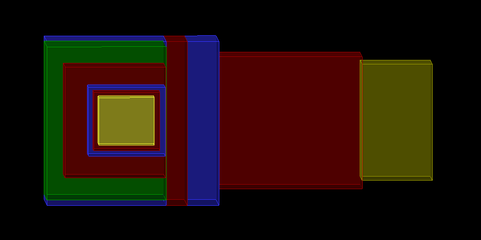

### UCAS组Geant4分析框架

### 1. 基于XML/GDML开发

### 2. 提供ROOT支持

### 3. 提供Optical光学/TRD穿越辐射物理过程支持

### 开发联系： liuqian@ucas.ac.cn

####  edited by Ao : 1279664237@qq.com ; Please forgive my Chinglish. I'm responsible for all coding mistakes found in this modified version.  And as a beginner of both geant4 and c++, I will try my best to explain anything that I find interesting and not so trivial.

 
#### 1.overview

#####1.1   Detector Construction
&ensp; In the directory source/DetectorConstruction/src, MyDetectorConstruction.cc ,we design the constructor by  defining something like fParsar. It's one kind of 'explainer' (something like that). In this case ,we only need to modify the file in the gdml
&ensp; In the directory /gdml. there are three directory. Extend(I don not know for now); Structure(containing information about the constructor's  arrangement; arrange contain it's definition and place information).
&ensp; In the  Structure directory, you will find that main.gdml is linked to the directory Arrange/aCopy, and aCopy is the actual arrangement. It's the same for Widget. Please note that every arrangement contains something like reading the material from some file.
&ensp; Matirial directory define's the matirial we need. Check it to find a template
 
#####1.2 Analysis Manager
&ensp; The same thing goes with the analysis manager. We define MyAnalysisManager to escape from the work of revising the source in detial. All variables can be used as global constant(I cannot figure out how. The operating field cannot explain this.)
&ensp; And for the analysis,there're two ways to do it.  1. use g4root, G4AnalysisManager, the geant4 ntuple manager to store the data.2. use root, MyAnalysisManager->SimEvent or tree/branch, the root file to store the data. either way can work, choose one to fullfill your requirements.

* note : when you design a detector, remember to make sure that when you refer to something with "", it should be presicely the same as the thing you want to refer to. Even a space can be detected as error and make the programm dumped.*
 
#### 2.Introdution to the MINER detector constructed
&ensp;see  below, the dark yellow is graphite, red is high density polyethylene, blue is Pb,green is plastic scintillator. I cannot find neccessary parameters to define the PVD, so I just use the predifined Polyethylene Scintillator. And as for the core detector, I replace it by water for simplicity.
 
&ensp; In the future, I'll try to define the scintillator described by the article.
